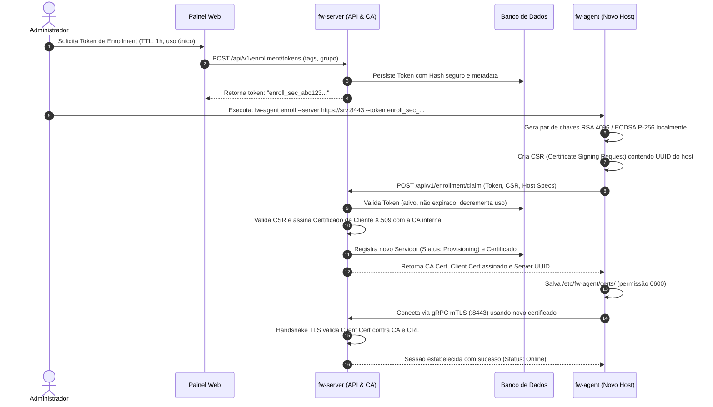
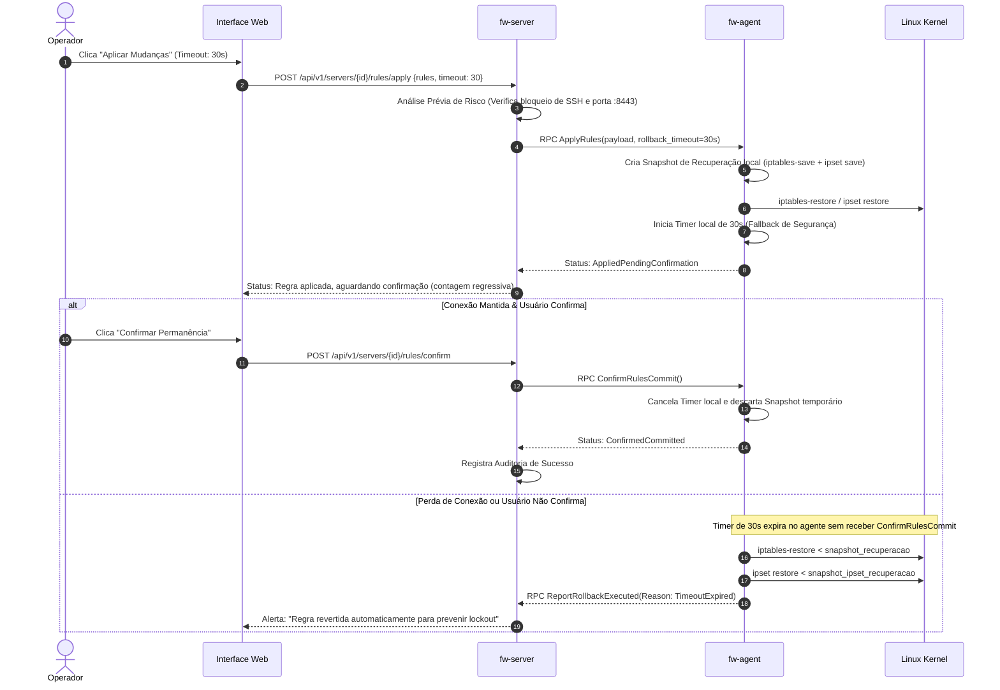

# Documento de Arquitetura — Linux Firewall Manager (LFM)

## 1. Visão Geral do Sistema

O **Linux Firewall Manager (LFM)** é uma solução corporativa de gerenciamento centralizado de firewalls baseados em `iptables`, `ip6tables` e `ipset` para frotas de servidores Linux. O sistema é composto por:
1. **Control Server (`fw-server`)**: Backend em Go com API REST, gRPC/mTLS bidirecional para comunicação com agentes, agendador de tarefas, motor de auditoria imutável e frontend web integrado (SPA React + Vite).
2. **Managed Agent (`fw-agent`)**: Binário estático e autônomo em Go, instalado em cada máquina alvo, operando em modo cliente (conexão de saída via TLS/mTLS), executando comandos tipados no kernel sem shell e implementando mecanismo de proteção contra lockout com rollback automático.

```mermaid
flowchart TB
    subgraph UI_Layer ["Interface Web & Operadores"]
        Browser["Navegador Web (SPA React + TS + Tailwind)"]
        AdminUser["Administrador / Operador"]
        AdminUser --> Browser
    end

    subgraph Control_Plane ["fw-server (Servidor de Controle)"]
        REST_API["API REST (Gin / Chi + OpenAPI 3)"]
        Auth_Module["Módulo Auth (OIDC PKCE + Local 'root' Argon2id + TOTP)"]
        RBAC_Audit["Motor RBAC & Trilha de Auditoria Imutável"]
        Cert_CA["Autoridade Certificadora Interna (mTLS CA & CRL)"]
        Agent_Hub["Agent Hub (gRPC / mTLS Server & Stream Dispatcher)"]
        Scheduler["Agendador de Tarefas (Backups & Blocklists)"]
        Metrics_Store["Agregador de Métricas & Downsampling"]
        DB[(Banco de Dados: SQLite / PostgreSQL)]
    end

    subgraph Managed_Node_1 ["Servidor Gerenciado 1 (Atrás de NAT)"]
        Agent_1["fw-agent Daemon"]
        Kernel_1["Linux Kernel (netfilter / iptables-nft / ipset)"]
    end

    subgraph Managed_Node_N ["Servidor Gerenciado N"]
        Agent_N["fw-agent Daemon"]
        Kernel_N["Linux Kernel (netfilter / iptables-legacy / ipset)"]
    end

    subgraph IdP ["Provedor de Identidade Externo"]
        OIDC_Provider["Keycloak / Google Workspace / Okta"]
    end

    Browser <-->|HTTPS / WSS / REST| REST_API
    REST_API <--> Auth_Module
    Auth_Module <-->|OAuth2 / OIDC Authorization Code + PKCE| OIDC_Provider
    REST_API <--> RBAC_Audit
    REST_API <--> DB
    Agent_Hub <--> DB
    Cert_CA <--> DB
    Scheduler <--> DB
    Metrics_Store <--> DB

    Agent_1 -->|Conexão de Saída mTLS (gRPC :8443)| Agent_Hub
    Agent_N -->|Conexão de Saída mTLS (gRPC :8443)| Agent_Hub

    Agent_1 <-->|iptables-restore / ipset (Zero-shell)| Kernel_1
    Agent_N <-->|iptables-restore / ipset (Zero-shell)| Kernel_N
```

---

## 2. Decisões de Stack e Justificativas Técnicas

| Componente | Tecnologia Escolhida | Justificativa Técnica |
| :--- | :--- | :--- |
| **Agente** | **Go (Golang)** | Compilação em binário estático único (`CGO_ENABLED=0`), pegada de memória desprezível (~15MB RSS), sem dependência de runtimes externos (glibc, Python, JVM). API nativa de invocação de subprocessos (`os/exec`) passando listas de strings estritas, eliminando injeção de shell. Suporte robusto a mTLS e HTTP/2 gRPC. |
| **Backend** | **Go (Golang)** | Altíssima performance de I/O assíncrono via goroutines, facilitando gerenciar 200+ conexões simultâneas de streaming de agentes com mínimo overhead de CPU/RAM. Geração nativa de OpenAPI e integração de banco sem ORMs pesados. |
| **Protocolo Agente-Servidor** | **gRPC sobre HTTP/2 com mTLS** (fallback WebSocket TLS) | Contratos estritamente tipados via Protocol Buffers v3. Suporte nativo a streams bidirecionais (para envio contínuo de métricas, heartbeat e fila de comandos em tempo real), cancelamento de contexto e multiplexação em uma única conexão TCP de saída. |
| **Frontend** | **React 19 + TypeScript + Vite + Tailwind CSS + TanStack Query** | Vite oferece build instantâneo e bundles otimizados. TanStack Query gerencia cache, invalidações e sincronização com backend com eficiência. Tailwind CSS permite interface moderna, responsiva, com dark/light mode e sem stylesheets legados. Internacionalização (i18n) em pt-BR e en nativa. |
| **Banco de Dados** | **SQLite (Modernc pure-Go) com suporte a PostgreSQL** | SQLite embarcado por padrão dispensa dependências externas em pequenas/médias instalações (zero-conf appliance). Driver pure-Go elimina CGO no servidor. Suporte a PostgreSQL via driver `pgx` para instalações em larga escala ou clustering. Migrações versionadas via `golang-migrate`. |
| **Empacotamento** | **nfpm** | Ferramenta flexível em Go capaz de gerar pacotes `.deb` e `.rpm` em pipeline único sem precisar de utilitários pesados de sistema (`dpkg-deb`, `rpmbuild`), com suporte a scripts de hooks e units systemd. |

---

## 3. Segurança e Protocolo de Comunicação

### 3.1. Modelo de Conexão: Outbound-Only
Servidores protegidos frequentemente residem atrás de NAT, CGNAT ou firewalls de borda restritivos.
- O **agente sempre inicia a conexão de saída** até a porta de controle do servidor (`fw-server:8443`).
- Nenhuma porta aberta de escuta é criada no servidor gerenciado.
- Uma vez estabelecido o canal gRPC/HTTP/2 sobre mTLS, o canal torna-se **bidirecional full-duplex**, permitindo que o servidor envie comandos instantaneamente para o agente.

### 3.2. Fluxo de Enrollment e Ciclo de Vida de Certificados (mTLS)



- **Rotação de Certificados**: O agente solicita renovação automática quando 70% do tempo de vida do certificado expirar, enviando nova CSR assinada pela chave privada atual. O painel também permite forçar rotação sob demanda.
- **Revogação (CRL)**: O administrador pode revogar qualquer servidor pela UI. O número de série do certificado é adicionado à lista de revogação em memória no `fw-server`, derrubando imediatamente a sessão gRPC e impedindo novas reconexões.

---

## 4. Arquitetura do Agente (`fw-agent`)

### 4.1. Princípio de Execução Segura (Zero-Shell)
O agente **nunca** executa comandos arbitrários ou strings concatenadas via `/bin/sh` ou `bash`.
- Todas as operações são traduzidas para chamadas diretas de executáveis (`/sbin/iptables`, `/sbin/ip6tables`, `/sbin/ipset`) usando fatias de argumentos isoladas (`[]string`).
- O agente rejeita qualquer payload que contenha caracteres de controle de terminal ou separadores de comando (`|`, `;`, `&`, `\n`, `` ` ``, `$`).

### 4.2. Detecção de Backend do Kernel
Na inicialização e durante a coleta de inventário, o agente inspeciona o sistema:
1. Executa `iptables -V` e analisa a assinatura:
   - `iptables v1.8.x (nf_tables)` $\rightarrow$ **Backend NFTables** detectado.
   - `iptables v1.8.x (legacy)` $\rightarrow$ **Backend Legacy** detectado.
2. Inspeciona se `/usr/sbin/iptables` aponta para `xtables-nft-multi` ou `xtables-legacy-multi`.
3. Testa disponibilidade de `ip6tables` e `ipset` no kernel.
4. Coleta métricas de hardware: SO/distro (`/etc/os-release`), versão do kernel (`uname -r`), uptime e interfaces de rede ativas.

### 4.3. Interface com o Kernel e Atomicidade
- **Leitura**: Utiliza `iptables-save -c` e `ip6tables-save -c` para extrair todas as tabelas (`filter`, `nat`, `mangle`, `raw`, `security`), chains, regras e contadores em formato padronizado. Para ipset, utiliza `ipset save`.
- **Escrita Atômica**:
  - Para alterações de regras: Compila o ruleset em formato `iptables-restore` e submete via `stdin` com a flag `--noflush` (para aplicar apenas deltas/regras modificadas sem zerar conexões ativas) ou com substituição de chain atômica.
  - Para ipset: Utiliza a técnica de swap atômico:
    ```bash
    ipset create <set>_tmp <tipo> <opções>
    ipset restore < entradas_em_lote
    ipset swap <set> <set>_tmp
    ipset destroy <set>_tmp
    ```
  Isso garante **tempo zero de indisponibilidade** e evita pacotes descartados durante atualizações massivas de listas de IPs.

---

## 5. Proteção Contra Lockout: "Confirmar ou Reverter" (Safety Mechanism)

Um dos maiores riscos no gerenciamento remoto de firewalls é o operador aplicar uma regra que corte seu próprio acesso SSH ou a conexão de telemetria do agente.



### 5.1. Regras de Prevenção Ativa (Heurísticas do Agente)
Antes mesmo de submeter as regras ao kernel, o agente e o servidor executam uma validação estática:
1. **Regra Anti-Lockout do Agente**: Alerta se a chain `OUTPUT` ou `INPUT` bloquear tráfego para o IP do `fw-server` na porta do control plane (ex.: `8443/tcp`).
2. **Regra Anti-Lockout SSH**: Alerta se as regras bloquearem a porta SSH (porta detectada no `sshd_config` ou padrão 22/tcp), exceto se houver regra explícita anterior permitindo `ESTABLISHED,RELATED` e a sub-rede de administração.
3. Se a regra for de alto risco, a UI exige que o usuário digite `"CONFIRMAR"` e o tempo padrão de auto-rollback é estendido para 60 segundos.

---

## 6. Detecção de Drift e Sincronização

1. **Estado Desejado vs. Estado Real**: O servidor armazena no banco de dados a versão canônica aprovada do firewall de cada máquina (gerando um hash SHA-256 do arquivo `iptables-save` normalizado, ignorando contadores voláteis).
2. **Coleta de Verificação**: A cada $N$ minutos ou sob demanda, o agente envia o hash do ruleset em execução no kernel.
3. **Identificação de Divergência**:
   - Se o hash diferir do estado desejado no banco, o servidor marca a máquina com o status **DRIFT_DETECTED**.
   - O painel exibe um **Diff Visual Unificado** entre o que foi configurado centralmente e o que foi alterado localmente por administradores na linha de comando do servidor.
   - O operador tem duas opções na UI:
     1. **Sobrescrever**: Forçar aplicação do estado do servidor na máquina.
     2. **Adotar (Import)**: Importar o estado atual da máquina como nova versão no servidor.

---

## 7. Motor de Métricas e Contadores

```
[Pacotes / Bytes no Kernel] 
         │ (A cada 10s via iptables-save -c)
         ▼
    [fw-agent] 
         │ Calcula deltas (pps, bps), detecta resets
         ▼ (Stream gRPC)
    [fw-server (Metrics Aggregator)]
         │
         ├── Buffer em memória (Janela deslizante de 1h para gráficos de alta resolução)
         ├── Downsampling periódico (médias de 5m, 1h, 1d) para retenção histórica
         └── Alerta de Regras Órfãs / Sem Hits (sem variação de contadores há X dias)
```

- **Cálculo de Taxa Real**:
  $$\text{pps} = \frac{\Delta \text{packets}}{\Delta t}, \quad \text{bps} = \frac{\Delta \text{bytes} \times 8}{\Delta t}$$
- **Tratamento de Reset**: Se $\text{packets}_{\text{atual}} < \text{packets}_{\text{anterior}}$, o agente detecta que o contador foi zerado ou que o servidor reiniciou, ajustando o cálculo para evitar picos negativos falsos.

---

## 8. Autenticação, Autorização e Trilha de Auditoria

### 8.1. Estratégia de Identidade
- **Usuário Local Único (`root`)**:
  - Exatamente um usuário local no sistema.
  - Senha com derivação de chave **Argon2id** ($m=64\,\text{MB}$, $t=3$, $p=2$).
  - Suporte a 2FA via **TOTP (RFC 6238)** com QR Code e chaves de recuperação.
  - Bloqueio progressivo contra força bruta (5 tentativas falhas $\rightarrow$ bloqueio temporário de 15 min).
- **Integração OIDC (OpenID Connect)**:
  - Fluxo *Authorization Code Flow com PKCE*.
  - Suporte a múltiplos provedores (Keycloak, Google Workspace, Microsoft Entra, Okta).
  - Mapeamento dinâmico de claims de grupos/roles para os papéis da aplicação.

### 8.2. Matriz de Permissões (RBAC)

| Papel | Permissões no Sistema | Escopo Possível |
| :--- | :--- | :--- |
| **Admin** | Acesso irrestrito a configurações do sistema, OIDC, CA mTLS, usuários, auditoria e todos os servidores. | Global |
| **Operator** | Criar, editar, aplicar, reverter regras e ipsets, disparar backups e restores nos servidores atribuídos. | Servidores específicos, Grupos ou Tags |
| **Viewer** | Visualizar regras, métricas, logs de auditoria e status de servidores, sem permissão de escrita. | Servidores específicos, Grupos ou Tags |

### 8.3. Trilha de Auditoria Imutável
Todas as ações de mutação geram registros append-only na tabela `audit_logs`:
- **Campos**: Timestamp UTC, Actor (ID, username, IP de origem, User-Agent), Tipo de Ação, Alvos (IDs dos servidores afetados), Payload/Diff da alteração (JSON Patch), Resultado (Sucesso, Falha, Revertido por Rollback), Código de Resposta.
- Os logs de auditoria não possuem endpoint de remoção ou modificação na API REST.

---

## 9. Estratégia de Persistência no Host Gerenciado

Para que as regras aplicadas sobrevivam ao reboot físico da máquina gerenciada:
- **Debian / Ubuntu**: O agente salva em `/etc/iptables/rules.v4` e `/etc/iptables/rules.v6`, integrando com o pacote `netfilter-persistent` / `iptables-persistent`.
- **RHEL / Rocky / AlmaLinux**: O agente salva em `/etc/sysconfig/iptables` e `/etc/sysconfig/ip6tables`, integrando com `iptables-services`.
- O agente também mantém um backup de segurança em `/var/lib/fw-agent/rules.active`.
