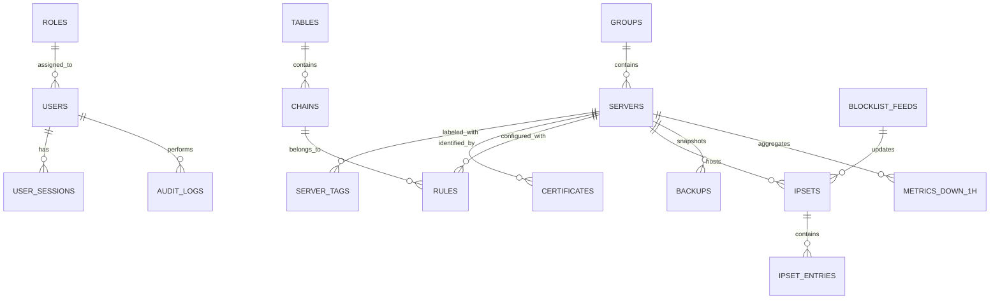

# Modelo de Dados e Esquema de Banco de Dados — LFM

## 1. Visão Geral e Estratégia de Persistência

O Linux Firewall Manager suporta **SQLite** por padrão (para implantações simples, standalone e appliances) e **PostgreSQL** (para ambientes corporativos com alta concorrência).
O esquema utiliza DDL compatível com ANSI SQL padrão, com chaves UUID em formato string (CHAR(36) ou UUID nativo), timestamps em UTC ISO 8601 e campos estruturados em JSON/JSONB.

---

## 2. Diagrama Entidade-Relacionamento (ERD)



---

## 3. Especificação DDL das Tabelas (SQL)

### 3.1. Autenticação, Usuários e RBAC

```sql
-- Tabela de Usuários (Apenas 'root' local + identidades sincronizadas via OIDC)
CREATE TABLE users (
    id VARCHAR(36) PRIMARY KEY,
    username VARCHAR(64) NOT NULL UNIQUE,
    display_name VARCHAR(128) NOT NULL,
    email VARCHAR(255),
    auth_type VARCHAR(16) NOT NULL DEFAULT 'local', -- 'local' ou 'oidc'
    password_hash VARCHAR(255),                     -- Argon2id (NULL para OIDC)
    totp_secret VARCHAR(64),                        -- Chave Base32 TOTP criptografada
    totp_enabled BOOLEAN NOT NULL DEFAULT FALSE,
    role VARCHAR(32) NOT NULL DEFAULT 'viewer',     -- 'admin', 'operator', 'viewer'
    scoped_tags JSON,                               -- Array de tags permitidas (ex: ["prod", "web"])
    scoped_groups JSON,                             -- Array de UUIDs de grupos permitidos
    failed_login_attempts INT NOT NULL DEFAULT 0,
    locked_until TIMESTAMP NULL,
    created_at TIMESTAMP NOT NULL DEFAULT CURRENT_TIMESTAMP,
    updated_at TIMESTAMP NOT NULL DEFAULT CURRENT_TIMESTAMP
);

-- Tabela de Sessões Ativas
CREATE TABLE user_sessions (
    id VARCHAR(36) PRIMARY KEY,
    user_id VARCHAR(36) NOT NULL REFERENCES users(id) ON DELETE CASCADE,
    session_token_hash VARCHAR(64) NOT NULL UNIQUE, -- SHA-256 do token do cookie
    ip_address VARCHAR(45) NOT NULL,
    user_agent TEXT,
    expires_at TIMESTAMP NOT NULL,
    created_at TIMESTAMP NOT NULL DEFAULT CURRENT_TIMESTAMP
);

-- Configurações Globais e Provedores OIDC
CREATE TABLE system_settings (
    key VARCHAR(64) PRIMARY KEY,
    value_json JSON NOT NULL,
    updated_by VARCHAR(36) REFERENCES users(id),
    updated_at TIMESTAMP NOT NULL DEFAULT CURRENT_TIMESTAMP
);
```

### 3.2. Servidores Gerenciados e Agentes

```sql
-- Grupos de Servidores
CREATE TABLE server_groups (
    id VARCHAR(36) PRIMARY KEY,
    name VARCHAR(64) NOT NULL UNIQUE,
    description TEXT,
    created_at TIMESTAMP NOT NULL DEFAULT CURRENT_TIMESTAMP,
    updated_at TIMESTAMP NOT NULL DEFAULT CURRENT_TIMESTAMP
);

-- Servidores Gerenciados
CREATE TABLE servers (
    id VARCHAR(36) PRIMARY KEY,
    hostname VARCHAR(255) NOT NULL,
    ip_address VARCHAR(45) NOT NULL,
    group_id VARCHAR(36) REFERENCES server_groups(id) ON DELETE SET NULL,
    status VARCHAR(24) NOT NULL DEFAULT 'offline', -- 'online', 'offline', 'drift', 'applying', 'error'
    agent_version VARCHAR(32),
    os_distro VARCHAR(64),
    kernel_version VARCHAR(64),
    iptables_backend VARCHAR(24),                 -- 'nftables', 'legacy'
    ipv6_supported BOOLEAN NOT NULL DEFAULT FALSE,
    drift_detected BOOLEAN NOT NULL DEFAULT FALSE,
    last_drift_check TIMESTAMP NULL,
    last_canonical_hash VARCHAR(64),              -- SHA-256 da configuração aprovada no host
    last_seen_at TIMESTAMP NULL,
    created_at TIMESTAMP NOT NULL DEFAULT CURRENT_TIMESTAMP,
    updated_at TIMESTAMP NOT NULL DEFAULT CURRENT_TIMESTAMP
);

-- Tags de Servidores (Relacionamento N:M ou Chave-Valor)
CREATE TABLE server_tags (
    server_id VARCHAR(36) NOT NULL REFERENCES servers(id) ON DELETE CASCADE,
    tag_name VARCHAR(64) NOT NULL,
    PRIMARY KEY (server_id, tag_name)
);

-- Tokens de Enrollment (Uso único, expiração)
CREATE TABLE enrollment_tokens (
    id VARCHAR(36) PRIMARY KEY,
    token_hash VARCHAR(64) NOT NULL UNIQUE, -- SHA-256 do token plaintext
    target_group_id VARCHAR(36) REFERENCES server_groups(id) ON DELETE SET NULL,
    initial_tags JSON,                      -- Tags pré-configuradas para o novo servidor
    max_uses INT NOT NULL DEFAULT 1,
    uses_count INT NOT NULL DEFAULT 0,
    expires_at TIMESTAMP NOT NULL,
    created_by VARCHAR(36) REFERENCES users(id),
    created_at TIMESTAMP NOT NULL DEFAULT CURRENT_TIMESTAMP
);

-- Certificados Emitidos para Agentes (mTLS PKI)
CREATE TABLE agent_certificates (
    id VARCHAR(36) PRIMARY KEY,
    server_id VARCHAR(36) NOT NULL REFERENCES servers(id) ON DELETE CASCADE,
    serial_number VARCHAR(64) NOT NULL UNIQUE,
    fingerprint_sha256 VARCHAR(64) NOT NULL UNIQUE,
    certificate_pem TEXT NOT NULL,
    revoked BOOLEAN NOT NULL DEFAULT FALSE,
    revoked_at TIMESTAMP NULL,
    revocation_reason VARCHAR(255),
    expires_at TIMESTAMP NOT NULL,
    created_at TIMESTAMP NOT NULL DEFAULT CURRENT_TIMESTAMP
);
```

### 3.3. Modelo de Tabelas, Chains e Regras de Firewall

```sql
-- Tabelas e Chains
CREATE TABLE firewall_chains (
    id VARCHAR(36) PRIMARY KEY,
    server_id VARCHAR(36) NOT NULL REFERENCES servers(id) ON DELETE CASCADE,
    table_name VARCHAR(16) NOT NULL,              -- 'filter', 'nat', 'mangle', 'raw', 'security'
    chain_name VARCHAR(64) NOT NULL,              -- Built-in (INPUT, OUTPUT, FORWARD...) ou Custom
    is_builtin BOOLEAN NOT NULL DEFAULT TRUE,
    ip_version VARCHAR(4) NOT NULL DEFAULT 'v4',  -- 'v4' ou 'v6'
    default_policy VARCHAR(16) DEFAULT 'ACCEPT',  -- 'ACCEPT', 'DROP', 'RETURN'
    packet_counter BIGINT DEFAULT 0,
    byte_counter BIGINT DEFAULT 0,
    updated_at TIMESTAMP NOT NULL DEFAULT CURRENT_TIMESTAMP,
    UNIQUE(server_id, table_name, chain_name, ip_version)
);

-- Regras de Firewall Estruturadas
CREATE TABLE firewall_rules (
    id VARCHAR(36) PRIMARY KEY,
    chain_id VARCHAR(36) NOT NULL REFERENCES firewall_chains(id) ON DELETE CASCADE,
    server_id VARCHAR(36) NOT NULL REFERENCES servers(id) ON DELETE CASCADE,
    position INT NOT NULL,                        -- Ordem na chain (1-based)
    protocol VARCHAR(16) DEFAULT 'all',           -- 'tcp', 'udp', 'icmp', 'all'
    src_ip VARCHAR(64),                           -- CIDR ou IP único
    dst_ip VARCHAR(64),                           -- CIDR ou IP único
    in_interface VARCHAR(32),                     -- eth0, ens3, etc.
    out_interface VARCHAR(32),                    -- eth1, wg0, etc.
    src_ports VARCHAR(128),                       -- Ex: "80,443" ou "1000:2000"
    dst_ports VARCHAR(128),
    state_match VARCHAR(64),                      -- Ex: "NEW,ESTABLISHED,RELATED"
    tcp_flags VARCHAR(64),                        -- Ex: "SYN,RST,ACK,FIN SYN"
    limit_rate VARCHAR(32),                       -- Ex: "10/sec", "100/minute"
    limit_burst INT,
    match_set_name VARCHAR(64),                   -- Nome do ipset associado
    match_set_direction VARCHAR(16),              -- 'src', 'dst', 'src,dst'
    target VARCHAR(32) NOT NULL,                  -- 'ACCEPT', 'DROP', 'REJECT', 'LOG', 'DNAT', etc.
    target_options JSON,                          -- Ex: {"to_destination": "10.0.0.1:80"}
    comment VARCHAR(255),
    raw_rule_text TEXT,                           -- Definição canônica equivalente
    packet_counter BIGINT DEFAULT 0,
    byte_counter BIGINT DEFAULT 0,
    last_hit_at TIMESTAMP NULL,
    created_at TIMESTAMP NOT NULL DEFAULT CURRENT_TIMESTAMP,
    updated_at TIMESTAMP NOT NULL DEFAULT CURRENT_TIMESTAMP
);

-- Rascunhos e Alterações Pendentes (Drafts)
CREATE TABLE rule_change_drafts (
    id VARCHAR(36) PRIMARY KEY,
    target_servers JSON NOT NULL,                 -- Lista de IDs de servidores afetados
    diff_payload JSON NOT NULL,                   -- Diffs estruturados de adições/remoções
    status VARCHAR(24) NOT NULL DEFAULT 'draft',  -- 'draft', 'pending_approval', 'applied', 'discarded'
    author_id VARCHAR(36) NOT NULL REFERENCES users(id),
    created_at TIMESTAMP NOT NULL DEFAULT CURRENT_TIMESTAMP,
    updated_at TIMESTAMP NOT NULL DEFAULT CURRENT_TIMESTAMP
);
```

### 3.4. IPSets e Blocklists Dinâmicas

```sql
-- Definição de Sets
CREATE TABLE ipsets (
    id VARCHAR(36) PRIMARY KEY,
    server_id VARCHAR(36) NOT NULL REFERENCES servers(id) ON DELETE CASCADE,
    name VARCHAR(64) NOT NULL,
    type_name VARCHAR(32) NOT NULL,               -- 'hash:ip', 'hash:net', 'hash:ip,port', 'list:set'
    family VARCHAR(8) NOT NULL DEFAULT 'inet',    -- 'inet' (IPv4) ou 'inet6' (IPv6)
    maxelem BIGINT DEFAULT 65536,
    timeout_sec INT DEFAULT 0,
    comment_enabled BOOLEAN DEFAULT TRUE,
    counters_enabled BOOLEAN DEFAULT FALSE,
    memory_size_bytes BIGINT DEFAULT 0,
    elements_count BIGINT DEFAULT 0,
    created_at TIMESTAMP NOT NULL DEFAULT CURRENT_TIMESTAMP,
    updated_at TIMESTAMP NOT NULL DEFAULT CURRENT_TIMESTAMP,
    UNIQUE(server_id, name)
);

-- Entradas dos Sets
CREATE TABLE ipset_entries (
    id VARCHAR(36) PRIMARY KEY,
    ipset_id VARCHAR(36) NOT NULL REFERENCES ipsets(id) ON DELETE CASCADE,
    entry_value VARCHAR(128) NOT NULL,            -- IP, CIDR ou IP,PORT
    comment VARCHAR(255),
    timeout_remaining INT,
    packets BIGINT DEFAULT 0,
    bytes BIGINT DEFAULT 0,
    created_at TIMESTAMP NOT NULL DEFAULT CURRENT_TIMESTAMP,
    UNIQUE(ipset_id, entry_value)
);

-- Fontes Externas de Blocklist (Threat Intelligence)
CREATE TABLE blocklist_feeds (
    id VARCHAR(36) PRIMARY KEY,
    name VARCHAR(64) NOT NULL UNIQUE,
    url TEXT NOT NULL,
    refresh_cron VARCHAR(32) NOT NULL,            -- Ex: "0 */6 * * *"
    target_set_name VARCHAR(64) NOT NULL,
    auto_apply_servers JSON NOT NULL,             -- Array de tags ou IDs de servidores
    last_fetch_at TIMESTAMP NULL,
    last_fetch_status VARCHAR(24),                -- 'success', 'error'
    entries_count INT DEFAULT 0,
    is_active BOOLEAN NOT NULL DEFAULT TRUE,
    created_at TIMESTAMP NOT NULL DEFAULT CURRENT_TIMESTAMP
);
```

### 3.5. Backups, Snapshots e Histórico de Versões

```sql
CREATE TABLE firewall_backups (
    id VARCHAR(36) PRIMARY KEY,
    server_id VARCHAR(36) NOT NULL REFERENCES servers(id) ON DELETE CASCADE,
    backup_type VARCHAR(24) NOT NULL,             -- 'manual', 'scheduled', 'pre_apply_snapshot'
    description VARCHAR(255),
    iptables_save_v4 MEDIUMTEXT NOT NULL,
    iptables_save_v6 MEDIUMTEXT,
    ipset_save MEDIUMTEXT,
    checksum_sha256 VARCHAR(64) NOT NULL,
    created_by VARCHAR(36) REFERENCES users(id),
    created_at TIMESTAMP NOT NULL DEFAULT CURRENT_TIMESTAMP
);
```

### 3.6. Métricas com Downsampling e Trilha de Auditoria

```sql
-- Métricas Horárias Agregadas (Downsampling para retenção a longo prazo)
CREATE TABLE rule_metrics_1h (
    id BIGINT PRIMARY KEY AUTO_INCREMENT, -- Ou BIGSERIAL em PG
    rule_id VARCHAR(36) NOT NULL REFERENCES firewall_rules(id) ON DELETE CASCADE,
    server_id VARCHAR(36) NOT NULL REFERENCES servers(id) ON DELETE CASCADE,
    hour_bucket TIMESTAMP NOT NULL,
    delta_packets BIGINT NOT NULL,
    delta_bytes BIGINT NOT NULL,
    peak_pps DOUBLE NOT NULL,
    peak_bps DOUBLE NOT NULL,
    created_at TIMESTAMP NOT NULL DEFAULT CURRENT_TIMESTAMP
);
CREATE INDEX idx_metrics_bucket ON rule_metrics_1h (rule_id, hour_bucket);

-- Trilha de Auditoria Imutável (Append-Only)
CREATE TABLE audit_logs (
    id VARCHAR(36) PRIMARY KEY,
    timestamp TIMESTAMP NOT NULL DEFAULT CURRENT_TIMESTAMP,
    actor_id VARCHAR(36) REFERENCES users(id),
    actor_username VARCHAR(64) NOT NULL,
    ip_address VARCHAR(45) NOT NULL,
    action VARCHAR(64) NOT NULL,                  -- 'RULE_APPLY', 'ROLLBACK_AUTO', 'IPSET_UPDATE', etc.
    target_servers JSON NOT NULL,                 -- IDs dos servidores impactados
    diff_payload JSON,                            -- Mudanças específicas aplicadas
    result VARCHAR(24) NOT NULL,                  -- 'SUCCESS', 'FAILURE', 'REVERTED'
    details TEXT
);
CREATE INDEX idx_audit_timestamp ON audit_logs (timestamp DESC);
CREATE INDEX idx_audit_actor ON audit_logs (actor_username);
```
