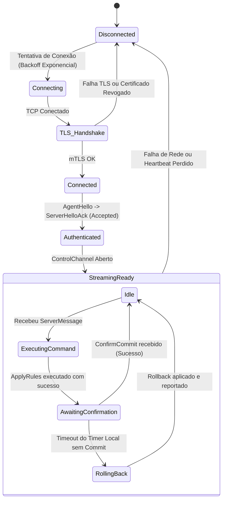

# Protocolo de Comunicação Servidor-Agente (Wire Protocol)

## 1. Visão Geral

A comunicação entre o **fw-server** (Control Plane) e os **fw-agent** (Managed Daemons) ocorre através de uma conexão gRPC bidirecional sobre HTTP/2 com mTLS rigoroso na porta TCP `8443`.
- **Iniciação**: O agente sempre realiza o handshake TLS de saída conectando-se ao servidor.
- **Autenticação de Transporte**: mTLS X.509. O servidor valida o certificado do cliente contra a CA interna e lista de revogação (CRL); o cliente valida o certificado do servidor contra o CA bundle instalado durante o enrollment.
- **Garantias**:
  - Mensagens fortemente tipadas (Protocol Buffers v3).
  - Execução remota sem shell (apenas structs com campos estruturados).
  - Controle de fluxo com confirmação explícita (ACK/NACK) e timeout de rollback automático no agente.

---

## 2. Definição do Serviço Protobuf (`agent_service.proto`)

```protobuf
syntax = "proto3";

package lfm.protocol.v1;

option go_package = "lnx-firewall-manager/internal/proto/v1;protov1";

// Serviço gRPC principal mantido pelo fw-server
service FirewallControlService {
  // Stream bidirecional de controle de longa duração
  rpc ControlChannel(stream AgentMessage) returns (stream ServerMessage);

  // Stream dedicado de telemetria contínua (estatísticas de pacotes/bytes)
  rpc TelemetryStream(stream TelemetryBatch) returns (TelemetryAck);
}

// Mensagem enviada pelo Agente para o Servidor no ControlChannel
message AgentMessage {
  string message_id = 1;
  string agent_uuid = 2;
  int64 timestamp_utc = 3;

  oneof payload {
    AgentHello hello = 10;
    AgentHeartbeat heartbeat = 11;
    CommandExecutionResult cmd_result = 12;
    RollbackReport rollback_report = 13;
    DriftAlert drift_alert = 14;
  }
}

// Mensagem enviada pelo Servidor para o Agente no ControlChannel
message ServerMessage {
  string command_id = 1;
  int64 timestamp_utc = 2;

  oneof payload {
    ServerHelloAck hello_ack = 10;
    ApplyRulesCommand apply_rules = 11;
    ConfirmRulesCommand confirm_commit = 12;
    RestoreBackupCommand restore_backup = 13;
    ManageIPSetCommand manage_ipset = 14;
    CollectStateCommand collect_state = 15;
    ResetCountersCommand reset_counters = 16;
  }
}

// Handshake inicial do agente após estabelecer TLS
message AgentHello {
  string hostname = 1;
  string agent_version = 2;
  string os_distro = 3;
  string kernel_version = 4;
  string iptables_backend = 5; // "nftables" ou "legacy"
  bool ipv6_supported = 6;
  repeated string active_interfaces = 7;
  string current_rules_hash = 8;
}

message ServerHelloAck {
  bool accepted = 1;
  string error_reason = 2;
  int32 heartbeat_interval_seconds = 3;
  int32 telemetry_interval_seconds = 4;
}

message AgentHeartbeat {
  int64 uptime_seconds = 1;
  double load_average_1m = 2;
  string running_rules_hash = 3;
}

// Comando de aplicação de regras com proteção de lockout
message ApplyRulesCommand {
  string change_id = 1;
  int32 rollback_timeout_seconds = 2; // Ex: 30s
  bool atomic_noflush = 3;
  string iptables_restore_v4 = 4;
  string iptables_restore_v6 = 5;
  repeated IPSetBatchDefinition ipsets = 6;
}

// Confirmação final enviada pelo servidor quando o usuário aprova
message ConfirmRulesCommand {
  string change_id = 1;
}

// Relatório do agente quando o rollback local for acionado por falta de confirmação
message RollbackReport {
  string change_id = 1;
  string reason = 2; // "CONFIRMATION_TIMEOUT_EXPIRED" ou "EXECUTION_FAILURE"
  string previous_hash_restored = 3;
  int64 timestamp_restored = 4;
}

// Comando de gerenciamento atômico de IPSets
message ManageIPSetCommand {
  enum Action {
    CREATE = 0;
    DESTROY = 1;
    SWAP = 2;
    FLUSH = 3;
    REPLACE_ENTRIES = 4;
  }
  Action action = 1;
  string set_name = 2;
  string set_type = 3; // "hash:ip", "hash:net", etc.
  string family = 4;   // "inet" ou "inet6"
  int32 maxelem = 5;
  repeated string entries = 6;
}

// Relatório periódico de telemetria de contadores
message TelemetryBatch {
  string agent_uuid = 1;
  int64 timestamp_utc = 2;
  repeated RuleCounter counters = 3;
}

message RuleCounter {
  string table_name = 1;
  string chain_name = 2;
  int32 rule_position = 3;
  string rule_comment = 4;
  uint64 packets = 5;
  uint64 bytes = 6;
  uint64 delta_packets = 7;
  uint64 delta_bytes = 8;
}

message TelemetryAck {
  bool received = 1;
}

message CommandExecutionResult {
  string command_id = 1;
  bool success = 2;
  int32 exit_code = 3;
  string error_message = 4;
  string applied_hash = 5;
  int64 duration_ms = 6;
}

message DriftAlert {
  string expected_hash = 1;
  string actual_hash = 2;
  string raw_current_rules = 3;
}

message RestoreBackupCommand {
  string backup_id = 1;
  string iptables_v4_content = 2;
  string iptables_v6_content = 3;
  string ipset_content = 4;
}

message CollectStateCommand {
  bool include_counters = 1;
  bool include_ipsets = 2;
}

message ResetCountersCommand {
  string table_name = 1; // Vazio para todas as tabelas
  string chain_name = 2; // Vazio para todas as chains
  int32 rule_position = 3; // 0 para toda a chain
}
```

---

## 3. Estados e Ciclo de Vida da Conexão do Agente



---

## 4. Estratégia de Fallback e Resiliência

1. **Reconexão com Jitter e Backoff Exponencial**:
   - Intervalo inicial: $1\,\text{segundo}$.
   - Multiplicador: $1.5 \times$.
   - Teto máximo: $30\,\text{segundos} \pm 20\%$ de *random jitter* para prevenir *thundering herd* no servidor após reinicialização.
2. **Fila de Comandos Offline**:
   - Se o servidor emitir um comando enquanto o agente estiver momentaneamente desconectado, o comando fica retido na tabela de comandos pendentes com um TTL (tempo de expiração configurável, padrão 1 hora).
   - Ao restabelecer a conexão, o agente consome as mensagens pendentes garantindo idempotência através do `command_id`.
3. **Persistência de Falha Local**:
   - Caso o agente reinicie abruptamente durante o período de confirmação de regra, ao subir novamente ele lê `/var/lib/fw-agent/rollback.lock`. Se o arquivo existir e o tempo limite tiver expirado, ele **restaura imediatamente o snapshot anterior**, assegurando que uma queda de energia ou travamento nunca resulte em lockout permanente.
